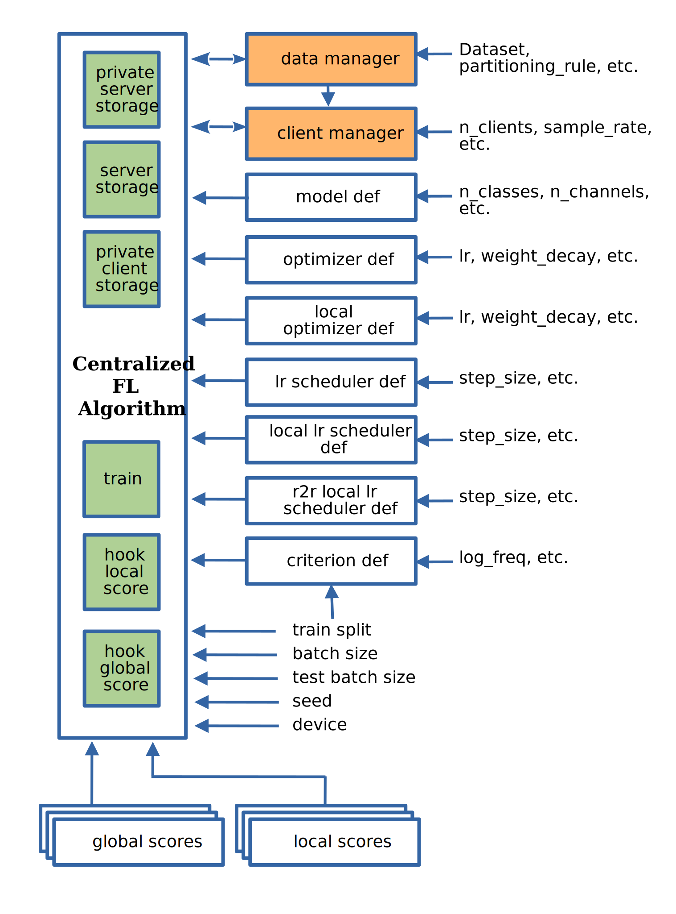

.. _custom_flalg:

Guide to centralized FL algorithms
==================================

Included FL algorithms
----------------------

.. list-table::
   :header-rows: 1

   * - Alias
     - Paper
   * - FedAvg
     - .. image:: https://img.shields.io/badge/arXiv-1602.05629-b31b1b.svg?style=flat-square
        :target: https://arxiv.org/abs/1602.05629
        :alt: arXiv

   * - FedNova
     - .. image:: https://img.shields.io/badge/arXiv-2007.07481-b31b1b.svg?style=flat-square
        :target: https://arxiv.org/abs/2007.07481
        :alt: arXiv

   * - FedProx
     - .. image:: https://img.shields.io/badge/arXiv-1812.06127-b31b1b.svg?style=flat-square
        :target: https://arxiv.org/abs/1812.06127
        :alt: arXiv

   * - FedDyn
     - .. image:: https://img.shields.io/badge/arXiv-2111.04263-b31b1b.svg?style=flat-square
        :target: https://arxiv.org/abs/2111.04263
        :alt: arXiv

   * - AdaBest
     - .. image:: https://img.shields.io/badge/arXiv-2204.13170-b31b1b.svg?style=flat-square
        :target: https://arxiv.org/abs/2204.13170
        :alt: arXiv

Algorithm interface
-------------------

Look at the design architecture illustrated in the image below.

Custom Centralized FL Algorithm
-------------------------------

Any Custom FL algorithm class should inherit from ``fedsim.distributed.centralized.CentralFLAlgorithm`` (or its children) and implement its abstract methods.

Algorithm Template
------------------

Here's the complete implementation of Federated Averaging (FedAvg) algorithm which could be used as a template:

.. code-block:: python

    import math
    from torch.utils.data import DataLoader
    from torch.utils.data import RandomSampler
    from fedsim.local.training import local_inference
    from fedsim.local.training import local_train
    from fedsim.local.training.step_closures import default_step_closure
    from fedsim.utils import initialize_module
    from fedsim.utils import vectorize_module

    from fedsim.distributed.centralized import CentralFLAlgorithm
    from fedsim.distributed.centralized.training import serial_aggregation

    class FedAvg(CentralFLAlgorithm):
        def __init__(
            self, data_manager, metric_logger, num_clients, sample_scheme, sample_rate, model_def, epochs,
            criterion_def, optimizer_def, local_optimizer_def, lr_scheduler_def, local_lr_scheduler_def,
            r2r_local_lr_scheduler_def, batch_size=32, test_batch_size=64, device="cuda",
        ):
            super(FedAvg, self).__init__(
                data_manager, metric_logger, num_clients, sample_scheme, sample_rate, model_def, epochs,
                criterion_def, optimizer_def, local_optimizer_def, lr_scheduler_def, local_lr_scheduler_def,
                r2r_local_lr_scheduler_def, batch_size, test_batch_size, device,
            )

            # make mode and optimizer
            model_def = self.get_model_def()
            model = model_def().to(device)
            params = vectorize_module(model, clone=True, detach=True)
            optimizer = optimizer_def(params=[params])
            lr_scheduler = None if lr_scheduler_def is None else lr_scheduler_def(optimizer=optimizer)
            # write model and optimizer to server
            server_storage = self.get_server_storage()
            server_storage.write("model", model)
            server_storage.write("cloud_params", params)
            server_storage.write("optimizer", optimizer)
            server_storage.write("lr_scheduler", lr_scheduler)

        def send_to_client(self, server_storage, client_id):
            # since fedavg broadcast the same model to all selected clients,
            # the argument client_id is not used

            # load cloud stuff
            cloud_params = server_storage.read("cloud_params")
            model = server_storage.read("model")
            # copy cloud params to cloud model to send to the client
            initialize_module(model, cloud_params, clone=True, detach=True)
            # return a copy of the cloud model
            return dict(model=model)

        # define client operation
        def send_to_server(
            self, id, rounds, storage, datasets, train_split_name, scores, epochs, criterion,
            train_batch_size, inference_batch_size, optimizer_def, lr_scheduler_def=None, device="cuda",
            ctx=None, step_closure=None,
        ):
            # create a random sampler with replacement so that
            # stochasticity is maximiazed and privacy is not compromized
            sampler = RandomSampler(
                datasets[train_split_name], replacement=True,
                num_samples=math.ceil(len(datasets[train_split_name]) / train_batch_size) * train_batch_size,
            )
            # # create train data loader
            train_loader = DataLoader(datasets[train_split_name], batch_size=train_batch_size, sampler=sampler)

            model = ctx["model"]
            optimizer = optimizer_def(model.parameters())
            lr_scheduler = None if lr_scheduler_def is None else lr_scheduler_def(optimizer=optimizer)

            # optimize the model locally
            step_closure_ = default_step_closure if step_closure is None else step_closure
            train_scores = scores[train_split_name] if train_split_name in scores else dict()
            num_train_samples, num_steps, diverged, = local_train(
                model, train_loader, epochs, 0, criterion, optimizer, lr_scheduler, device, step_closure_,
                scores=train_scores,
            )
            # get average train scores
            metrics_dict = {train_split_name: {name: score.get_score() for name, score in train_scores.items()}}
            # append train loss
            if rounds % criterion.log_freq == 0:
                metrics_dict[train_split_name][criterion.get_name()] = criterion.get_score()
            num_samples_dict = {train_split_name: num_train_samples}
            # other splits
            for split_name, split in datasets.items():
                if split_name != train_split_name and split_name in scores:
                    o_scores = scores[split_name]
                    split_loader = DataLoader( split, batch_size=inference_batch_size, shuffle=False)
                    num_samples = local_inference(model, split_loader, scores=o_scores, device=device)
                    metrics_dict[split_name] = {name: score.get_score() for name, score in o_scores.items()}
                    num_samples_dict[split_name] = num_samples
            # return optimized model parameters and number of train samples
            return dict(local_params=vectorize_module(model), num_steps=num_steps, diverged=diverged,
                num_samples=num_samples_dict,metrics=metrics_dict,
            )

        def receive_from_client(
            self, server_storage, client_id, client_msg, train_split_name, aggregation_results):
            return serial_aggregation(
                server_storage, client_id, client_msg, train_split_name, aggregation_results
            )

        def optimize(self, server_storage, aggregator):
            if "local_params" in aggregator:
                param_avg = aggregator.pop("local_params")
                optimizer = server_storage.read("optimizer")
                lr_scheduler = server_storage.read("lr_scheduler")
                cloud_params = server_storage.read("cloud_params")
                pseudo_grads = cloud_params.data - param_avg
                # update cloud params
                optimizer.zero_grad()
                cloud_params.grad = pseudo_grads
                optimizer.step()
                if lr_scheduler is not None:
                    lr_scheduler.step()
                # purge aggregated results
                del param_avg
            return aggregator.pop_all()

        def deploy(self, server_storage):
            return dict(avg=server_storage.read("cloud_params"))

        def report(
            self, server_storage, dataloaders, rounds, scores, metric_logger, device, optimize_reports,
            deployment_points=None,
        ):
            model = server_storage.read("model")
            scores_from_deploy = dict()
            if deployment_points is not None:
                for point_name, point in deployment_points.items():
                    # copy cloud params to cloud model to send to the client
                    initialize_module(model, point, clone=True, detach=True)

                    for split_name, loader in dataloaders.items():
                        if split_name in scores:
                            scores = scores[split_name]
                            _ = local_inference(model, loader, scores=scores, device=device)
                            split_scores = {
                                f"server.{point_name}.{split_name}.{score_name}": score.get_score()
                                    for score_name, score in scores.items()
                            }
                            scores_from_deploy = {**scores_from_deploy,**split_scores}
            return {**scores_from_deploy, **optimize_reports, **norm_reports}

You can easily make simple changed by inheriting from FedAvg or its children classes.
For example the following is the implementation of FedProx algorithm:

.. code-block:: python

    from functools import partial
    from torch.nn.utils import parameters_to_vector
    from fedsim.local.training.step_closures import default_step_closure
    from fedsim.utils import vector_to_parameters_like
    from fedsim.utils import vectorize_module

    from fedsim.distributed.centralized import FedAvg

    class FedProx(fedavg.FedAvg):
        def __init__(
            self, data_manager, metric_logger, num_clients, sample_scheme, sample_rate, model_def, epochs,
            criterion_def, optimizer_def, local_optimizer_def, lr_scheduler_def, local_lr_scheduler_def,
            r2r_local_lr_scheduler_def, batch_size=32, test_batch_size=64, device="cuda", mu=0.0001,
        ):
            super(FedAvg, self).__init__(
                data_manager, metric_logger, num_clients, sample_scheme, sample_rate, model_def, epochs,
                criterion_def, optimizer_def, local_optimizer_def, lr_scheduler_def, local_lr_scheduler_def,
                r2r_local_lr_scheduler_def, batch_size, test_batch_size, device,
            )
            server_storage.write("mu", mu)

        def send_to_client(self, server_storage, client_id):
            server_msg = super().send_to_client(server_storage, client_id)
            server_msg["mu"] = server_storage.read("mu")
            return server_msg

        def send_to_server(
            self, id, rounds, storage, datasets, train_split_name, scores, epochs, criterion,
            train_batch_size, inference_batch_size, optimizer_def, lr_scheduler_def=None, device="cuda",
            ctx=None, step_closure=None,
        ):
            model = ctx["model"]
            mu = ctx["mu"]
            params_init = vectorize_module(model, clone=True, detach=True)

            def transform_grads_fn(model):
                params = parameters_to_vector(model.parameters())
                grad_additive = 0.5 * (params - params_init)
                grad_additive_list = vector_to_parameters_like(mu * grad_additive, model.parameters())

                for p, g_a in zip(model.parameters(), grad_additive_list):
                    p.grad += g_a

            step_closure_ = partial(default_step_closure, transform_grads=transform_grads_fn)
            return super(FedProx, self).send_to_server(
                id, rounds, storage, datasets, train_split_name, scores, epochs, criterion, train_batch_size,
                inference_batch_size, optimizer_def, lr_scheduler_def, device, ctx, step_closure=step_closure_,
            )

Integration with fedsim-cli
~~~~~~~~~~~~~~~~~~~~~~~~~~~

To automatically include your custom algorithm by the provided cli tool, you can define it in a python and pass its path to ``-a`` or ``--algorithm`` option (without .py) followed by column and name of the algorithm.
For example, if you have algorithm ``CustomFLAlgorithm`` stored in a ``foo/bar/my_custom_alg.py``, you can pass ``--algorithm foo/bar/my_custom_alg:CustomFLAlgorithm``.

.. note::

    Non-common Arguments of constructor of any algoritthm (mostly hyper-parameters) could be given in ``arg:value`` format following its name (or ``path`` if a local file is provided).
    Areguments that are common among the desired algorithm and CentralFLAlgorithm are internally assigned. Examples:

    .. code-block:: bash

        fedsim-cli fed-learn --algorithm AdaBest mu:0.01 beta:0.6 ...

    .. code-block:: bash

        fedsim-cli fed-learn --algorithm foo/bar/my_custom_alg:CustomFLAlgorithm mu:0.01 ...
