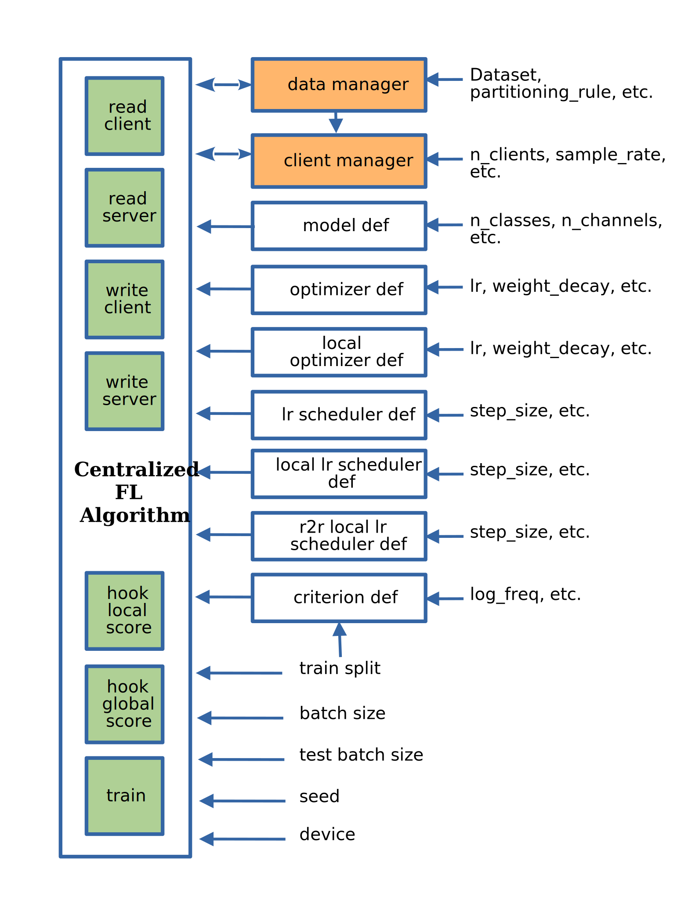

.. _custom_flalg:

Custom CentralFLAlgorithm
=========================

Any custome DataManager class should inherit from ``fedsim.distributed.centralized.CentralFLAlgorithm`` (or its children) and implement its abstract methods.

Architecture
------------

Example
-------

.. code-block:: python

    from typing import Optional, Hashable, Mapping, Dict, Any
    from fedsim.distributed.centralized import CentralFLAlgorithm

    class CustomFLAlgorithm(CentralFLAlgorithm):
        def __init__(
            data_manager, metric_logger, num_clients, sample_scheme, sample_rate, model_def, epochs, criterion,
            optimizer_def, local_optimizer_def, lr_scheduler_def=None, local_lr_scheduler_def,
            r2r_local_lr_scheduler_def=None, batch_size=32, test_batch_size=64, device="cuda", other_arg, ...
        ):
            self.other_arg = other_arg
            ...

            super(CustomFLAlgorithm, self).__init__(
                data_manager, metric_logger, num_clients, sample_scheme, sample_rate, model_def, epochs, criterion,
                optimizer_def, local_optimizer_def, lr_scheduler_def=None, local_lr_scheduler_def,
                r2r_local_lr_scheduler_def=None, batch_size=32, test_batch_size=64, device="cuda",
            )
            # make mode and optimizer
            model = self.get_model_def()().to(self.device)
            params = deepcopy(parameters_to_vector(model.parameters()).clone().detach())
            optimizer = optimizer_def(params=[params])
            lr_scheduler = None
            if lr_scheduler_def is not None:
                lr_scheduler = lr_scheduler_def(optimizer)
            # write model and optimizer to server
            self.write_server("model", model)
            self.write_server("cloud_params", params)
            self.write_server("optimizer", optimizer)
            self.write_server("lr_scheduler", lr_scheduler)
            ...

        def send_to_client(self, client_id: int) -> Mapping[Hashable, Any]:
            """ returns context to send to the client corresponding to the client_id.

            .. warning::
                Do not send shared objects like server model if you made any
                before you deepcopy it.

            Args:
                client_id (int): id of the receiving client

            Raises:
                NotImplementedError: abstract class to be implemented by child

            Returns:
                Mapping[Hashable, Any]: the context to be sent in form of a Mapping
            """
            ...

        def send_to_server(self, client_id: int, datasets: Dict[str, Iterable],
            round_scores: Dict[str, Dict[str, fedsim.scores.Score]], epochs: int, criterion: nn.Module,
            train_batch_size: int, inference_batch_size: int, optimizer_def: Callable,
            lr_scheduler_def: Optional[Callable] = None, device: Union[int, str] = "cuda",
            ctx: Optional[Dict[Hashable, Any]] = None) -> Mapping[str, Any]:
            """client operation on the recieved information.

            Args:
                client_id (int): id of the client
                datasets (Dict[str, Iterable]): this comes from Data Manager
                round_scores (Dict[str, Dict[str, fedsim.scores.Score]]): dictionary of
                    form {'split_name':{'score_name': score_def}} for global scores to
                    evaluate at the current round.
                epochs (``int``): number of epochs to train
                criterion (nn.Module): either 'ce' (for cross-entropy) or 'mse'
                train_batch_size (int): training batch_size
                inference_batch_size (int): inference batch_size
                optimizer_def (float): class for constructing the local optimizer
                lr_scheduler_def (float): class for constructing the local lr scheduler
                device (Union[int, str], optional): Defaults to 'cuda'.
                ctx (Optional[Dict[Hashable, Any]], optional): context reveived.

            Returns:
                Mapping[str, Any]: client context to be sent to the server
            """
            ...

        def receive_from_client(self, client_id: int, client_msg: Mapping[Hashable, Any], aggregator: Any):
            """ receive and aggregate info from selected clients

            Args:
                client_id (int): id of the sender (client)
                client_msg (Mapping[Hashable, Any]): client context that is sent
                aggregator (Any): aggregator instance to collect info

            """
            raise NotImplementedError

        def optimize(self, aggregator: Any) -> Mapping[Hashable, Any]:
            """ optimize server mdoel(s) and return metrics to be reported

            Args:
                aggregator (Any): Aggregator instance

            Returns:
                Mapping[Hashable, Any]: context to be reported
            """
            ...

        def deploy(self) -> Optional[Mapping[Hashable, Any]]:
            """ return Mapping of name -> parameters_set to test the model

            """
            raise NotImplementedError

        def report(self, dataloaders, round_scores: Dict[str, Dict[str, Any]], metric_logger: Any,
            device: str, optimize_reports: Mapping[Hashable, Any],
            deployment_points: Optional[Mapping[Hashable, torch.Tensor]] = None) -> None:
            """test on global data and report info

            Args:
                dataloaders (Any): dict of data loaders to test the global model(s)
                metric_logger (Any): the logging object (e.g., SummaryWriter)
                device (str): 'cuda', 'cpu' or gpu number
                optimize_reports (Mapping[Hashable, Any]): dict returned by optimzier
                deployment_points (Mapping[Hashable, torch.Tensor], optional): output of deploy method

            """
            ...

Integration with fedsim-cli
~~~~~~~~~~~~~~~~~~~~~~~~~~~

To automatically include your custom algorithm by the provided cli tool, you can place your class in a python and pass its path to `-a` or `--algorithm` option (without .py) followed by column and name of the algorithm.
For example, if you have algorithm `CustomFLAlgorithm` stored in a `foo/bar/my_custom_alg.py`, you can pass `--algorithm foo/bar/my_custom_alg:CustomFLAlgorithm`.

.. note::

    Arguments of the **init** method of any algoritthm could be given in `arg:value` format following its name (or `path` if a local file is provided). Examples:

    .. code-block:: bash

        fedsim-cli fed-learn --algorithm AdaBest mu:0.01 beta:0.6 ...

    .. code-block:: bash

        fedsim-cli fed-learn --algorithm foo/bar/my_custom_alg:CustomFLAlgorithm mu:0.01 ...
